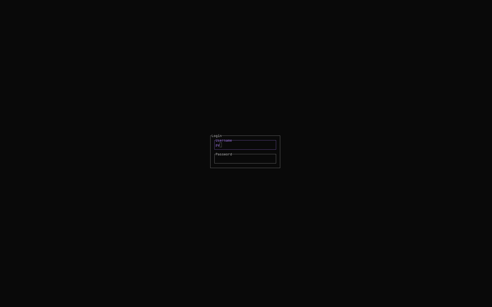

# rintty

A modern TUI login screen for Linux, designed as a replacement for `agetty`.



## Features

- 🎨 **Modern TUI**: Clean, interactive login interface built with [ratatui](https://github.com/ratatui-org/ratatui)
- 🔐 **PAM Authentication**: Secure authentication using the Linux PAM system
- 📱 **TTY Support**: Full TTY device control for real login sessions

## Usage

```bash
# Run on a specific TTY device
rintty /dev/tty1

# Run in test mode (no TTY required)
rintty

# Show password in plain text (for debugging)
rintty --show-password /dev/tty1
```

## Building

```bash
cargo build --release
```

## Status

⚠️ **Work in Progress** - This project is currently under active development.

## Requirements

- Linux system with PAM support
- Rust 1.70+

## License

[License information coming soon]
